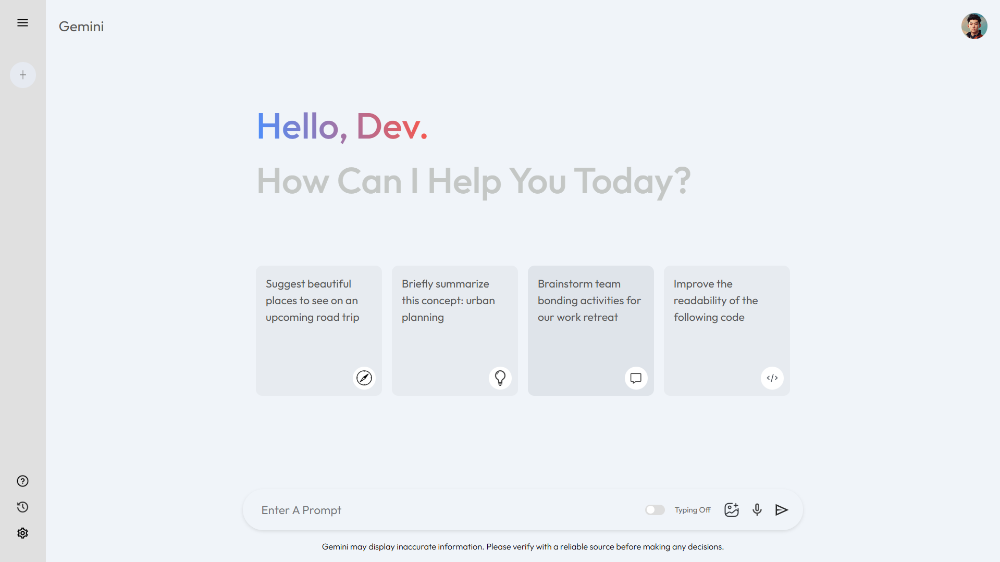

<a href="https://gemini-nj.netlify.app">Try out me!</a>

# Gemini Clone

A modern React application that replicates the functionality and UI of Google's Gemini AI assistant. This project provides a clean, responsive interface for interacting with the Gemini API.



## Features

- **AI-Powered Responses**: Connect to Google's Gemini API to generate intelligent responses
- **Typing Animation**: Toggle between instant responses or a realistic typing animation
- **Responsive Design**: Optimized for desktop, tablet, and mobile devices
- **Modern UI**: Clean interface with cards, loading animations, and intuitive controls
- **History Management**: Track previous prompts and easily start new conversations
- **Visual Feedback**: Loading indicators and clear visual cues for user interactions

## Tech Stack

- React.js
- Context API for state management
- Google Generative AI SDK
- CSS3 with responsive design principles
- Vite for fast development and building

## Getting Started

### Prerequisites

- Node.js (v14.0.0 or later)
- npm or yarn
- Google Gemini API key

### Installation

1. Clone the repository:
   ```bash
   git clone https://github.com/yourusername/gemini-clone.git
   cd gemini-clone
   ```

2. Install dependencies:
   ```bash
   npm install
   # or
   yarn install
   ```

3. Create a `.env` file in the root directory and add your Gemini API key:
   ```
   VITE_GEMINI_API_KEY=your_api_key_here
   ```

4. Start the development server:
   ```bash
   npm run dev
   # or
   yarn dev
   ```

5. Open your browser and navigate to `http://localhost:5173`

## Usage

1. **Ask a Question**: Type your prompt in the input field at the bottom of the screen
2. **Toggle Typing Animation**: Click the toggle switch to enable/disable the typing animation
3. **Clear Input**: Use the × button to quickly clear the input field
4. **Start a New Chat**: Click the "New Chat" button to reset the conversation
5. **Explore Suggestions**: Click on the suggestion cards on the home screen for quick prompts

## Project Structure

```
src/
├── assets/         # Images and icons
├── components/     # React components
│   ├── Main/       # Main content area
│   └── Sidebar/    # Navigation sidebar
├── config/         # Configuration files
│   └── Gemini.js   # Gemini API setup
├── context/        # React Context
│   └── Context.jsx # Global state management
├── App.jsx         # Root component
└── main.jsx        # Entry point
```

## Features in Detail

### Typing Animation

The application includes a realistic typing animation that simulates the AI typing out responses in real-time. This can be toggled on or off based on user preference.

### Responsive Design

The UI adapts to different screen sizes:
- Desktop: Full sidebar and expanded controls
- Tablet: Compact sidebar and optimized card layout
- Mobile: Minimized controls and single-column layout

### Loading Indicators

Custom-designed loading indicators provide visual feedback while waiting for API responses, mimicking content placeholders for a smoother user experience.

## Contributing

Contributions are welcome! Please feel free to submit a Pull Request.

1. Fork the repository
2. Create your feature branch (`git checkout -b feature/amazing-feature`)
3. Commit your changes (`git commit -m 'Add some amazing feature'`)
4. Push to the branch (`git push origin feature/amazing-feature`)
5. Open a Pull Request

## License

This project is licensed under the MIT License - see the LICENSE file for details.

## Acknowledgments

- Google's Gemini API for powering the AI responses
- Inspiration from Google's Gemini interface
